# GoDoc Take-Home Assessment - Document Upload & Acknowledgement

A role-based flow where one party uploads a consultation-related document
and a second party acknowledges, rejects, or sends it back for revision -
with visibility rules scoped by who uploaded what and who's allowed to
review it.

## Contents

- [Context & who the end users are](#context--who-the-end-users-are)
- [Answering the assessment's three questions](#answering-the-assessments-three-questions)
- [Tech stack & why](#tech-stack--why)
- [Code repo structure](#code-repo-structure)
- [Database schema & storage lifecycle](#database-schema--storage-lifecycle)
- [Authentication & roles](#authentication--roles)
- [State machine](#state-machine)
- [Editing, deletion & retention](#editing-deletion--retention)
- [Setup & run](#setup--run)
- [Running tests](#running-tests)
- [Try it yourself - testing each role](#try-it-yourself---testing-each-role)
- [API overview](#api-overview)
- [Assumptions](#assumptions)
- [Edge cases considered](#edge-cases-considered)
- [Known limitations & what I'd add next](#known-limitations--what-id-add-next)
- [A note on the committed `.env`](#a-note-on-the-committed-env)

## Context & who the end users are

The brief intentionally keeps the roles generic: it says a document can be
uploaded, and **a second party** can acknowledge that it’s been received/
reviewed—without specifying who that is (patient/doctor, etc.). I treated that
as a product requirement, not a guess, and designed the flow around what the
system needs to enforce: who can upload and who can review/acknowledge.
Here’s how that decision shaped the implementation.


- I modeled the two sides of the flow as **capabilities** (`can upload`,
  `can approve`) rather than fixed personas (`Patient`, `Doctor`, `Admin`).
  Baking in a specific persona pairing would have meant guessing at a
  business rule the brief never states.
- It's also the more scalable choice, which the brief explicitly asks for:
  onboarding a new kind of user later (a nurse who can both upload and
  approve, a compliance reviewer who only approves, an ops account that
  only uploads) is "assign them the right capabilities," not "add a new
  named role and re-audit every route that checks role strings by name."
  `lib/roles.ts` is the single place that logic lives.
- Plausible real-world mappings this could support without any code
  change: a clinic staff member uploads a signed consent form and a doctor
  acknowledges it, *or* a consultant uploads a report and a supervising
  lead reviews it. The system doesn't need to know which - it only cares
  about capability.
- The seed data (`carol@godoc.test`, "Lead Consultant") leans toward a
  consultancy/clinic setting since the brief frames this as
  "consultation-related," but that's flavor text for the demo, not a
  constraint baked into the schema or the access-control logic.

## Answering the assessment's three questions

The brief asks three specific things for this scope option. Short answers
here, with links into the fuller sections below.

**(1) Where and how the file is stored, and what metadata you track**

- Short answer: the file goes to local disk under a generated (never
  user-supplied) filename, and every field the app tracks - identity,
  status, and who-did-what-when for every outcome - lives in one
  `documents` table.
- Full schema, an ERD, the file-naming/path-traversal reasoning, and how
  the storage location would change in production are in
  [Database schema & storage lifecycle](#database-schema--storage-lifecycle)
  below.

**(2) The state machine for a document's lifecycle**

- `UPLOADED` → `ACKNOWLEDGED` (terminal) / `REJECTED` (terminal, auto-purged
  30 days later) / `NEEDS_REVISION` → (uploader resubmits) → back to
  `UPLOADED`. Full diagram, the atomic-transition mechanics, and answers to
  "what happens after acknowledged/rejected" and "what if the document is
  nearly right but needs a fix" are in [State machine](#state-machine).

**(3) Basic validation, e.g. file types, size limits, failure handling**

- File type: an allowlist (`ALLOWED_MIME_TYPES` env var; default PDF, PNG,
  JPEG, DOC, DOCX), checked against the mime type multer detects from the
  upload, not just the filename extension. See `src/lib/validation.ts`.
- Size limit: `MAX_FILE_SIZE_MB` env var (default 10MB), enforced by
  multer's `limits.fileSize` while the multipart body is still being
  parsed - an oversized file is rejected before it's fully buffered or
  written to disk, not after.
- Failure handling: invalid type/size → `400` with an `errors` array (the
  frontend surfaces this in an error banner) and the partially-written file
  is deleted immediately so rejected uploads don't leak onto disk; missing
  file → `400`; failed auth or missing role capability → `401`/`403`
  *before* validation even runs; two requests racing on the same state
  transition → `409`; requesting a document outside your visibility →
  `404` (deliberately not `403` - see [Authentication & roles](#authentication--roles)).
  More in [Edge cases considered](#edge-cases-considered).

## Tech stack & why

| Layer | Choice | Why |
|---|---|---|
| Backend | Node.js + Express + TypeScript | Small, well-understood surface area for a scoped assessment; TypeScript catches the kind of state/typo mistakes that matter in a state-machine-heavy flow with role checks layered on top. |
| Database | SQLite via Node's built-in `node:sqlite` | Zero external services to stand up, single file, built into Node 22+ so `npm install` never touches a native compiler or the network. I moved off `better-sqlite3` (the more typical choice) specifically because it needs prebuilt binaries / a source build, which is real setup friction on a reviewer's machine. |
| Auth | `bcryptjs` + `jsonwebtoken`, JWT in an httpOnly cookie | No external auth provider needed for a scoped assessment, but still real password hashing and a real signed session token rather than a trust-the-client name field. httpOnly means the token isn't readable from JS (mitigates XSS token theft); `bcryptjs` is pure JS (same native-build-avoidance reasoning as SQLite). |
| File storage | Local disk (`multer.diskStorage`) | Simplest thing that works for a take-home; metadata lives in the DB, the file lives in `/uploads` referenced by a generated filename. |
| Frontend | React + Vite + TypeScript | Minimal build setup, fast dev loop, satisfies the "modern JS framework" bonus without the overhead of a full Next.js app for a handful of screens. |
| Tests | Jest + Supertest | Supertest drives the real Express app (routing, middleware, auth, validation, status codes) without a live server, and its `.agent()` persists cookies across requests so multi-step "login, then act" flows are easy to test. |

**Alternatives I considered, and what I'd pick in production**

- **Database - SQLite vs Postgres.** SQLite's single-writer model (WAL
  mode lets readers proceed during a write, but writes still serialize) is
  fine for one process and a demo dataset; it stops being fine the moment
  there's more than one app instance, which is exactly the "more load"
  axis the brief asks about. In production I'd move to Postgres - and
  specifically **managed** Postgres (RDS / Cloud SQL / Neon) over
  self-hosting it, to avoid owning backups, failover, and patching. The
  migration itself would be contained: every query already goes through
  parameterized prepared statements in `src/lib/documents.ts` and
  `src/lib/users.ts`, so swapping the driver underneath (`node:sqlite` →
  `pg`) shouldn't require touching the routes or business logic above it.
- **Serverless vs managed database, since it came up.** Serverless
  Postgres (Neon, PlanetScale-style branching, Supabase) is attractive for
  scale-to-zero cost and instant preview-environment branches, but comes
  with connection-pooling gotchas (each serverless function invocation can
  open its own connection, which adds up fast) and a bit of vendor
  lock-in. A traditional managed instance (RDS/Cloud SQL) is simpler to
  reason about for a steady-traffic API like this one; I'd default to that
  unless traffic were genuinely spiky.
- **Backend framework - Express vs NestJS.** Express is the right call
  here: six routes, three middleware, no team to onboard. NestJS's
  enforced module/DI structure earns its weight once "more developers"
  becomes real - the brief's scalability framing - but it's boilerplate
  overhead for this scope.
- **Auth - hand-rolled JWT vs a managed provider (Auth0/Clerk).** A
  managed provider buys MFA, social login, and password-reset flows for
  free, at the cost of another account a reviewer would need to configure
  to run this at all. Hand-rolling it here is also more honest about
  demonstrating the exact mechanics (JWT verification, RBAC) the
  assessment is testing.
- **File storage - local disk vs S3/GCS.** This is the item I'd change
  first for production, not last: local disk doesn't survive a
  multi-instance deployment (each instance would only see its own files),
  where S3 does, plus durability guarantees and presigned URLs that let
  large uploads/downloads bypass the API process entirely.

## Architecture

```Bash

 Browser (React SPA)
   |
   |  fetch(..., { credentials: "include" })
   |  JWT lives in an httpOnly cookie - frontend JS never touches it
   v
 Express app                                    src/app.ts
   |
   |-- /api/auth/*        -----------------> routes/auth.ts
   |                                          (login, logout, me)
   |
   `-- /api/documents/*   -----------------> routes/documents.ts
          |
          v
        requireAuth                           middleware/auth.ts
        (verify the JWT, load req.user)
          |
          v
        requireUpload / requireApprove /      per-route role gate
        requireManage Capability
          |
          v
        lib/documents.ts
        (visibility rules, state transitions, soft delete -
         plain functions, no Express types, unit-testable alone)
          |
          +-----------------+
          v                 v
        db/index.ts       uploads/
        (SQLite file)     (files on disk, generated filenames)
```

Role logic lives in exactly one place (`lib/roles.ts`) and visibility logic
in exactly one place (`listDocumentsForUser` / `canUserSeeDocument` in
`lib/documents.ts`) - routes call into these rather than re-implementing
the rules, so adding a fourth capability or a fourth visibility case later
is a change in one function, not a hunt through every route handler.

## Code repo structure

```Bash
frontend/
  src/
    App.tsx           Auth-gated shell: renders Login until a session exists,
                      then the workspace (upload panel + document grid)
    Login.tsx         Login form + one-click demo account fill-in
    api.ts            Typed fetch wrappers; every call sets credentials:
                      "include" so the session cookie rides along

src/
  app.ts              Express app wiring: middleware, route mounting, error
                      handler
  server.ts           Boots the app on PORT; auto-seeds demo users if empty;
                      starts the retention purge scheduler
  db/
    index.ts          SQLite connection + schema (CREATE TABLE, indexes) +
                      the fail-fast schema-mismatch guard
    demoUsers.ts      Shared demo account list (seed.ts and server.ts's
                      auto-seed-if-empty both read from here)
    seed.ts           `npm run seed` - explicit one-off seeding
  lib/
    validation.ts     Upload validation: mime type allowlist, size limit
    stateMachine.ts   Pure, declarative transition table for document status
    roles.ts          canUpload() / canApprove() / canManage() - the only
                      place role logic is defined
    users.ts          User creation, lookup, password hashing/verification
    tokens.ts         JWT sign/verify
    documents.ts      Data access: visibility filtering, state transitions,
                      file replacement, resubmit, soft delete
    retention.ts      Finds + purges expired REJECTED and soft-deleted rows
  middleware/
    auth.ts           requireAuth + one requireXCapability guard per action
  routes/
    auth.ts           login, logout, me
    documents.ts      upload, list, get, download, acknowledge, reject,
                      request-revision, resubmit, edit (PATCH), delete

tests/                Unit tests (validation, state machine, retention) +
                      integration tests via Supertest: auth, RBAC, visibility,
                      manage actions, revision workflow, retention sweeps
```

## Database schema & storage lifecycle

Two tables. Everything about a document - including who acted on it and
when - lives on one row, rather than a separate audit/event table(see
[Known limitations](#known-limitations--what-id-add-next).

```mermaid
erDiagram
    USERS ||--o{ DOCUMENTS : "uploads (uploader_id)"
    USERS ||--o{ DOCUMENTS : "acknowledges (acknowledged_by_id)"
    USERS ||--o{ DOCUMENTS : "rejects (rejected_by_id)"
    USERS ||--o{ DOCUMENTS : "requests revision on (revision_requested_by_id)"

    USERS {
        text id PK
        text name
        text email UK
        text password_hash
        text role "UPLOAD_ONLY / APPROVE_ONLY / UPLOAD_AND_APPROVE"
        text created_at
    }

    DOCUMENTS {
        text id PK
        text original_filename "human-readable, display + search only"
        text stored_filename "generated UUID + ext, the real on-disk name"
        text mime_type
        int size_bytes
        text uploader_id FK
        text status "UPLOADED / ACKNOWLEDGED / REJECTED / NEEDS_REVISION"
        text created_at
        text acknowledged_at
        text acknowledged_by_id FK
        text rejected_at
        text rejected_by_id FK
        text rejection_reason
        text revision_requested_at
        text revision_requested_by_id FK
        text revision_note
        text deleted_at "soft delete marker, see below"
    }
```



*(GitHub and most modern Markdown viewers render the block above as a
diagram directly; see `src/db/index.ts` for the literal `CREATE TABLE`
statements if your viewer doesn't render Mermaid.)*

**Where the file itself lives, separate from its metadata:**

- The file's bytes live on disk (`multer.diskStorage`), under `UPLOAD_DIR`
  (`uploads/` - a named Docker volume in the compose setup, so it survives
  container restarts).
- The on-disk filename is a generated UUID plus the original extension,
  **never** the user-supplied filename - this avoids both path traversal
  (a filename like `../../etc/passwd` never reaches the filesystem layer)
  and two different uploads silently overwriting each other if they
  happen to share a name.
- The human-readable original filename (`original_filename`) is *only*
  ever stored in the DB, and is reattached as the download's
  `Content-Disposition` header - the two identities (on-disk vs.
  display) are deliberately decoupled.
- Metadata (everything in the `documents` table above) lives entirely in
  SQLite, separate from the file bytes - the DB never stores file
  contents, only the `stored_filename` pointer to find them.

**Data lifecycle - what exists today, and what I'd add for real storage
tiering:**

- What's built: two age-based transitions, both covered in
  [Editing, deletion & retention](#editing-deletion--retention) - a
  `REJECTED` document's *row and file* are hard-deleted after
  `REJECTED_RETENTION_DAYS` (default 30), and a soft-deleted document's
  row and file are hard-deleted after `DELETED_RETENTION_DAYS` (default
  365). Both are "exists -> gone" transitions, not "hot -> cold" ones.
- What's **not** built, and the honest gap this question is really
  pointing at: an `ACKNOWLEDGED` document (the common end state for most
  documents) sits on the same storage for as long as it exists - there's
  no cheaper tier it ever moves to, even though it's realistically almost
  never accessed again after the review is done, only kept for
  audit/compliance purposes.
- How I'd actually build that, if asked to: this is a case where I'd
  **not** write custom application code for the transition at all. On
  S3 (the storage backend I'd already move to for the reasons in
  [Tech stack & why](#tech-stack--why)), I'd tag objects with their
  document status and let an **S3 Lifecycle Configuration rule** - a
  bucket-level policy, not app code - transition objects tagged
  `status=ACKNOWLEDGED` to Infrequent Access after, say, 90 days, and to
  Glacier Instant Retrieval after a year. S3 lifecycle rules run
  server-side on a schedule AWS manages; the app's only responsibility
  would be keeping the status tag in sync (already happening today via
  the same `acknowledgeDocument` write) and, if compliance ever needed a
  guaranteed retrieval-latency SLA, choosing Glacier Instant Retrieval
  over classic Glacier so a download doesn't unexpectedly take hours.
  This is squarely a "not implemented, but here's the design" answer -
  local disk has no equivalent concept of storage classes, so building
  it today would mean hand-rolling tier logic against a stack that's
  going to be replaced by S3 anyway (see
  [Known limitations](#known-limitations--what-id-add-next)).

## Authentication & roles

Every user has exactly one role, set at account creation (there's no
self-signup - see [Known limitations](#known-limitations--what-id-add-next)):

| Role | Can upload? | Can acknowledge / reject / request revision? | Can edit/delete *any* document? | Can see |
|---|---|---|---|---|
| `UPLOAD_ONLY` | Yes | No | No | Their own documents in any status, **plus** any document from anyone that's been `ACKNOWLEDGED` |
| `APPROVE_ONLY` | No | Yes | No | Every document, any status, any uploader |
| `UPLOAD_AND_APPROVE` ("lead") | Yes | Yes | Yes | Every document, any status, any uploader |

This is enforced in two independent places, deliberately:

1. **Route-level capability checks** (`requireUploadCapability` /
   `requireApproveCapability` / `requireManageCapability` middleware) - a
   `POST /api/documents` from a user without upload capability never
   reaches the upload logic; it gets a `403` immediately.
2. **Row-level visibility filtering** (`listDocumentsForUser`,
   `canUserSeeDocument`) - the part that actually answers "upload-only
   should only see their own uploaded files, plus every acknowledged file
   from anyone." Applied in the SQL for `GET /api/documents` *and*
   independently re-checked on `GET /api/documents/:id` and the download
   route, so guessing a document's UUID doesn't bypass list-level
   filtering - both return `404`, not `403`, for a document you're not
   allowed to know exists.

**Edit/delete/resubmit-on-behalf-of are deliberately narrower than
approve.** `canManage()` only returns true for `UPLOAD_AND_APPROVE`, not
`APPROVE_ONLY` - an approver can accept, reject, or request revision on a
document, but correcting or removing someone else's document is a bigger
action than a review decision, so it's scoped to the "lead" role
specifically.

Sessions are a JWT in an httpOnly cookie (`godoc_session`), issued on login
and verified on every request via `requireAuth`. The frontend never
touches the token directly - it calls `/api/auth/me` on load to figure out
whether there's a valid session.

**Demo accounts** (password for all: `password123`), auto-seeded on first
boot (or run `npm run seed` explicitly):

| Email | Role |
|---|---|
| `alice@godoc.test` | Upload only |
| `dana@godoc.test` | Upload only |
| `bob@godoc.test` | Approve only |
| `carol@godoc.test` | Upload & approve ("Lead Consultant") |

The login screen has one-click buttons to fill these in - see
[Try it yourself](#try-it-yourself---testing-each-role) for a guided
walkthrough across roles.

## State machine

```
        ACKNOWLEDGE
UPLOADED ─────────────────────► ACKNOWLEDGED     (terminal)
   │
   ├──────────────────────────► REJECTED         (terminal - auto-purged
   │         REJECT                                30 days later, see
   │                                                "Editing, deletion &
   │                                                retention" below)
   │
   └──────────────────────────► NEEDS_REVISION
        REQUEST_REVISION              │
                                      │ RESUBMIT (the uploader, or a lead,
                                      │  sends a corrected file)
                                       ▼
                                  UPLOADED   (back into the queue for a
                                              fresh review cycle)
```

- `UPLOADED` is where every document starts, and the only state an
  approver acts on directly.
- **What happens after `ACKNOWLEDGED`?** Nothing - it's a true terminal
  state today. There's no requirement in the brief for reopening an
  acknowledged document, and the practical way to correct a mistake
  discovered later is a lead using **Edit** (`PATCH`, see below), which
  resets the document to `UPLOADED` - that's a deliberate escape hatch
  outside the state machine, not a state-machine transition.
- **What happens after `REJECTED`?** Also terminal, but on a clock: it's
  auto-purged `REJECTED_RETENTION_DAYS` (default 30) days later. So
  `REJECTED`'s real "next state" isn't another document status - the row
  leaves the table entirely.
- **Is there a "this is close but needs a fix" scenario?** Yes -
  `NEEDS_REVISION`. An approver picks **Request revision** instead of a
  flat **Reject** when the document is broadly right but needs a fix or
  more information, with an optional note saying what's missing. Unlike
  `REJECTED`, this isn't terminal: the document's own uploader (or a lead,
  acting on their behalf) can **Resubmit** a corrected file via `POST
  /api/documents/:id/resubmit`, which moves it back to `UPLOADED` for a
  fresh review and clears the earlier revision-request fields. Resubmit is
  ownership-scoped - a different consultant can't resubmit someone else's
  flagged document - and uses the same atomic conditional-`UPDATE`
  pattern as every other transition, so a resubmit racing a lead's `Edit`
  on the same document can't corrupt either write.
- **Reject vs. request-revision:** reject means "wrong
  document, review is over, pick a different one to deal with"; request-
  revision means "this exact document is coming back, fix this one thing."
- Transitions are defined once, declaratively, in `src/lib/stateMachine.ts`
  (`canTransition` / `nextState`); route handlers never set `status`
  directly.
- **Who can act, and who they're recorded as:** the actor is always the
  authenticated session user (`req.user.id`), never a client-supplied
  name - `acknowledged_by_id` / `rejected_by_id` / `revision_requested_by_id`
  are foreign keys to `users`, and the API joins in the name for display.
- **Concurrency correctness on transitions:** two requests could race to
  act on the same document (double-click, two open tabs, a retried
  request). Every transition uses an atomic conditional update, e.g.
  `UPDATE documents SET status = ... WHERE id = ? AND status = 'UPLOADED'`
  (see `applyTransition` / `resubmitDocument` in `src/lib/documents.ts`).
  Exactly one `UPDATE` actually changes a row when two requests race; the
  loser sees `changes = 0` and gets a `409 Conflict` instead of silently
  overwriting the winner's decision. Covered by an integration test that
  fires two concurrent acknowledge requests from two different approvers
  and asserts exactly one succeeds.

## Editing, deletion & retention

Three lead-adjacent actions sit alongside the state machine rather than
inside it:

| Action | Endpoint | Who | From which status | Effect |
|---|---|---|---|---|
| Edit | `PATCH /:id` | Lead only (`canManage`) | Any status, any uploader | Replaces the file, resets to `UPLOADED`, clears every outcome field |
| Resubmit | `POST /:id/resubmit` | The document's own uploader, or a lead | `NEEDS_REVISION` only | Replaces the file, resets to `UPLOADED`, clears revision fields |
| Delete | `DELETE /:id` | Lead only (`canManage`) | Any status, any uploader | Soft delete - see below |

Edit and Resubmit look similar (both replace a file and reset to
`UPLOADED`) but answer different questions: Edit is "a lead correcting any
mistake, on any document, at any time"; Resubmit is "the uploader
responding to a specific piece of feedback on a document that's already
been flagged." Keeping them as separate endpoints keeps the permission
story simple - Edit's authorization check never has to reason about who
uploaded the document, and Resubmit's never has to reason about arbitrary
status transitions.

**Delete is a soft delete, not a hard delete.** `DELETE /:id` sets
`deleted_at` rather than removing the row:

- The document disappears from every read path **immediately**, for
  **every** role, including the lead who deleted it - the list endpoint,
  `GET /:id`, and the download route all treat a non-null `deleted_at` as
  "doesn't exist" (`getActiveDocumentRow` / `listDocumentsForUser`).
- The row in the DB and the file on disk are both left alone until the
  hard-purge sweep removes them for good, `DELETED_RETENTION_DAYS`
  (default 365) days later.
- Why: a real recovery window at the data layer, without building a full
  audit-log/versioning system for a take-home. See
  [Known limitations](#known-limitations--what-id-add-next) for the
  missing piece - there's no *restore endpoint* yet, so today that window
  is only usable by someone with direct DB access clearing `deleted_at` by
  hand, not through the API.

**Retention: two independent sweeps**, both pure functions in
`src/lib/retention.ts` (DB query + file cleanup, no HTTP involved, so
they're unit tested directly without a running server), both run once at
boot and then every 6 hours from `src/server.ts`:

- `purgeExpiredRejectedDocuments` - hard-deletes `REJECTED` documents older
  than `REJECTED_RETENTION_DAYS` (default 30).
- `purgeExpiredSoftDeletedDocuments` - hard-deletes soft-deleted documents
  (`deleted_at` set) older than `DELETED_RETENTION_DAYS` (default 365).

Both are deliberately naive schedulers, not a real job queue - worth being
upfront about the trade-off:

- Only runs while this one process is alive - a missed window because the
  process was down just means expired documents live a bit longer, not
  that anything breaks.
- Doesn't coordinate across multiple instances - each would run its own
  redundant sweep if this were ever scaled horizontally.
- A production version would move this to a proper cron trigger or queue
  worker calling the same purge functions - already decoupled from
  Express specifically so that swap doesn't touch the retention logic
  itself.

The frontend shows a "days until auto-delete" hint on rejected document
cards, computed client-side from `rejected_at` assuming the default
30-day window - it'd need to be passed down from the API instead of
assumed if the retention window is ever made per-deployment configurable
in a way the frontend needs to reflect exactly.

## Setup & run

**Requirements:** either Docker, **or** Node.js 22.5+ (for the built-in
`node:sqlite` module) - you don't need both. Pick one path below.

### Option A - Docker (recommended)

```bash
git clone <your-fork-url>
cd godoc-document-ack
docker compose up --build
```

That's the entire setup. A few things worth knowing about what just
happened:

- Two containers start: **backend** (the Express API, port 4000 inside the
  Docker network) and **frontend** (nginx serving the built React app and
  reverse-proxying `/api/*` to the backend, exposed on **port 8080**).
- There's no separate "start the database" step - SQLite is just a file
  inside the backend container, created automatically the first time it
  boots. There's no separate seed step either - `server.ts` auto-seeds the
  four demo accounts if the users table is empty.
- `npm install` never runs on your machine in this path - it only runs
  inside the Docker build, isolated in the image layer.
- Open **<http://localhost:8080>** and log in with any demo account from
  [Authentication & roles](#authentication--roles).
- Data persists across `docker compose down` / `up` via two named volumes
  (`backend_data` for the SQLite file, `backend_uploads` for uploaded
  files). To start completely fresh - e.g. after pulling a change that
  altered the DB schema - run `docker compose down -v` first (this wipes
  demo data too; see the comment in `src/db/index.ts` for why there's no
  migration tool to do this more gracefully).
- To run the test suite inside Docker instead of on your host, see
  [Running tests](#running-tests) below.

### Option B - locally with Node.js 22.5+

Two terminals - the backend and the frontend are separate dev servers.

```bash
# Terminal 1 - backend
git clone <your-fork-url>
cd godoc-document-ack
npm install
npm run build
npm run seed      # optional: creates the demo accounts explicitly.
                   # server.ts also auto-seeds them on first boot if the
                   # users table is empty, so this step can be skipped.
npm start          # or `npm run dev` for auto-reload while developing
# -> API listening on http://localhost:4000
```

```bash
# Terminal 2 - frontend (open a new terminal, same repo)
cd godoc-document-ack/frontend
npm install
npm run dev
# -> app on http://localhost:5173, proxying /api/* to the backend on :4000
```

- **Database:** nothing to install or start separately. SQLite is a single
  file the backend creates automatically at `data/dev.db` the first time
  it runs (path configurable via `DATABASE_PATH` in `.env`).
- **`npm install` here installs into your local machine's `node_modules`**
  - this is the non-Docker path. If you'd rather nothing touch your local
    machine, use Option A instead.
- Open **<http://localhost:5173>** and log in with any demo account.

## Running tests

```bash
npm test
```

- Runs the full Jest + Supertest suite: 48 tests across 6 files (auth,
  RBAC/manage actions, document visibility, the revision-request/resubmit
  workflow, both retention sweeps, plus pure unit tests for validation and
  the state machine).
- Each test *file* gets its own isolated SQLite DB and upload directory
  (`tests/setupEnv.ts`), so nothing leaks between test files or collides
  with your dev data - safe to run alongside a `docker compose up` or
  `npm run dev` you already have going.
- Works identically whether you set up via Docker or locally - it doesn't
  need either stack running; Supertest drives the Express app in-process,
  no network calls.
- To run it inside Docker instead of on your host:
  `docker compose run --rm backend npm test` (uses the backend image's own
  Node version and dependencies, touches nothing on your machine).

## Try it yourself - testing each role

The fastest way to see the whole flow, including the parts that only make
sense across two accounts at once:

1. Open two browser windows (or one normal + one incognito - the session
   is a cookie, so two tabs in the same window share a login). Log in as
   **<alice@godoc.test>** (upload only) in one, **<bob@godoc.test>** (approve
   only) in the other. The login screen has one-click buttons for each
   demo account.
2. **As alice:** upload any PDF or image. It shows up as "Awaiting
   review."
3. **As bob:** refresh - you'll see alice's document (approvers see
   everything). Type a short note like "please attach the consent form
   too" and click **Request revision**.
4. **As alice:** refresh - the same document now shows "Needs revision"
   with bob's note. Click **Resubmit corrected file** and upload a new
   file - it goes back to "Awaiting review."
5. **As bob:** refresh, then click **✓ Acknowledge** this time - status
   flips to "Acknowledged," visible to alice too.
6. **As alice:** upload a second document, then **as bob:** **✕ Reject**
   it (with or without a reason). Note the "auto-deletes in N days"
   countdown that appears on the card.
7. Log in as **<carol@godoc.test>** (upload & approve, the seeded "lead") in
   a third tab - she sees every document regardless of uploader or status
   (not just her own + acknowledged), and gets **Edit** / **Delete**
   buttons on every card. Try editing a document she didn't upload, and
   deleting one - it disappears from every account's view immediately.
8. Log in as **<dana@godoc.test>** (also upload-only) and confirm she
   *cannot* see alice's still-pending or needs-revision documents - only
   the one alice's had acknowledged. That's the visibility rule from
   [Authentication & roles](#authentication--roles) in action.

## API overview

All routes except `/api/auth/login` require a valid session cookie.

| Method | Path | Capability required | Notes |
|---|---|---|---|
| POST | `/api/auth/login` | - | `{ email, password }` -> sets the session cookie |
| POST | `/api/auth/logout` | authenticated | Clears the session cookie |
| GET | `/api/auth/me` | authenticated | Current user, or `401` |
| POST | `/api/documents` | upload | Multipart `file` field |
| GET | `/api/documents` | authenticated | `?status=&search=` - visibility-filtered |
| GET | `/api/documents/:id` | authenticated + visible | `404` if hidden or soft-deleted |
| GET | `/api/documents/:id/download` | authenticated + visible | Streams the file |
| POST | `/api/documents/:id/acknowledge` | approve | `UPLOADED` -> `ACKNOWLEDGED` |
| POST | `/api/documents/:id/reject` | approve | `{ reason? }` - `UPLOADED` -> `REJECTED` |
| POST | `/api/documents/:id/request-revision` | approve | `{ note? }` - `UPLOADED` -> `NEEDS_REVISION` |
| POST | `/api/documents/:id/resubmit` | upload + (owner or manage) | Multipart `file` - `NEEDS_REVISION` -> `UPLOADED` |
| PATCH | `/api/documents/:id` | manage (lead) | Multipart `file` - any status -> `UPLOADED` |
| DELETE | `/api/documents/:id` | manage (lead) | Soft delete, `204` |

## Assumptions

- A user has exactly one role for the lifetime of the account; there's no
  admin UI to change it, only the seed data / direct DB access.
- The uploader of a document is always the authenticated user making the
  request - there's no "upload on behalf of someone else" (a lead's Edit
  replaces a file but doesn't reassign `uploader_id`).
- Revision notes and rejection reasons are optional free text with no
  length limit beyond the request body size - fine for a take-home, would
  need a cap in production to bound storage and rendering cost.
- Resubmission is scoped to the document's original uploader or a lead -
  not to "anyone with upload capability," since letting an unrelated
  upload-only user resubmit someone else's flagged document doesn't match
  any real ownership model.
- "Acknowledge" means the second party has received and reviewed the
  document - there's no separate "received" vs. "reviewed" distinction,
  since the brief doesn't ask for one and it would double the state count
  for no clear benefit at this scope.
- File identity for display/search purposes is the human-readable
  `original_filename`; two different uploaders can use the same filename
  without conflict, since the actual on-disk identity is the generated
  `stored_filename`.

## Edge cases considered

- **Two approvers racing** to acknowledge/reject/request-revision the same
  document -> atomic conditional `UPDATE`, the loser gets `409` (covered
  by an integration test with two concurrent requests).
- **A resubmit racing a lead's Edit** on the same `NEEDS_REVISION`
  document -> same atomic pattern, only one write wins.
- **Mismatched file extension vs. actual content** (e.g. a `.pdf` that
  isn't really a PDF) - validation checks the mime type multer/the browser
  reports, not the filename extension, but that's still spoofable via the
  `Content-Type` header; there's no magic-byte sniffing (see
  [Known limitations](#known-limitations--what-id-add-next)).
- **Guessing another user's document UUID** (e.g. a leaked download link)
  -> `GET /:id` and the download route re-run the same visibility check as
  the list endpoint and return `404`, not `403`, so a hidden document's
  existence isn't leaked by the status code either.
- **Deleting a document mid-download** - soft delete only flips a flag on
  the row; an in-flight `res.download()` stream isn't interrupted, and the
  file on disk isn't touched until the (much later) hard-purge sweep. A
  fresh request for the same document immediately after the delete gets
  `404`.
- **A document rejected exactly at the retention boundary** - the purge
  query uses `<=` on the cutoff timestamp, tested directly against
  backdated `rejected_at`/`deleted_at` values.
- **No file / empty file on upload, edit, or resubmit** -> `400` before
  anything touches the DB, and any partially-written file multer created
  is deleted immediately.
- **A user's session is still valid but their account was removed from the
  DB** (not reachable via any current endpoint, but defended anyway) ->
  `requireAuth` re-loads the user by id on every request rather than
  trusting the JWT payload alone, so a missing user is a fresh `401`.
- **The retention sweep firing while the app is otherwise busy** - it only
  ever touches `REJECTED` or already-soft-deleted rows, both of which are
  terminal/hidden from every other code path already, so there's nothing
  else in flight it could race against.

## Known limitations & what I'd add next

- **No restore endpoint for soft-deleted documents.** The data survives
  for `DELETED_RETENTION_DAYS`, but there's no `GET /api/documents/deleted`
  or `POST /:id/restore` to use that window through the API - a
  straightforward next slice, deliberately left out to keep this
  submission's scope tight.
- **No migration tool.** Schema changes require a documented reset (see
  the fail-fast check in `src/db/index.ts`) rather than an in-place
  `ALTER TABLE` migration - fine for a take-home with no real user data at
  stake, not how I'd want to ship a schema change against a production
  database.
- **Local disk storage doesn't survive multiple app instances** - each
  instance would only see the files it personally wrote. The fix is S3/GCS
  with the DB holding the object key, already called out in
  [Tech stack & why](#tech-stack--why).
- **The retention scheduler is naive** (in-process `setInterval`, no
  cross-instance coordination) - covered in
  [Editing, deletion & retention](#editing-deletion--retention).
- **No magic-byte file-type sniffing** - validation trusts the mime type
  multer reports rather than inspecting file contents.
- **No self-signup or user-management UI** - accounts exist only via seed
  data or direct DB access.
- **The document list has no pagination** - `listDocumentsForUser` returns
  every visible row in one query. Completely fine for a demo dataset,
  would need `LIMIT`/keyset pagination (and probably a total-count
  endpoint) well before this reached real production volume.
- **Not deployed to a live environment.** The brief lists this as an
  optional bonus; I prioritized time on the areas the brief marks as
  required (tech stack justification, state machine, validation, tests)
  and on responding to review feedback on this README instead of adding a
  hosting account to the mix. Deploying it would mean: a host with a
  persistent disk for the SQLite file and uploads (Fly.io or Railway, both
  support volumes - a plain serverless platform like Vercel would not,
  since the filesystem there is ephemeral), a production `JWT_SECRET`
  distinct from the committed dev one, and `DATABASE_PATH`/`UPLOAD_DIR`
  pointed at the mounted volume.

**If I were told to make this handle meaningfully more load or more
developers** (the brief's actual framing for "scalable"), roughly in the
order I'd do them:

1. Postgres instead of SQLite, behind the same `lib/documents.ts` /
   `lib/users.ts` functions - the query layer is already parameterized, so
   this is a driver swap, not a rewrite.
2. S3/GCS for file storage, with presigned upload/download URLs so large
   files don't round-trip through the API process at all.
3. Pagination on the document list, before it's a real problem.
4. Extract the retention sweep into a proper scheduled worker (queue
   consumer or platform cron) instead of an in-process timer.
5. A shared types package (or a generated OpenAPI client) between
   `frontend/src/api.ts` and `src/lib/documents.ts`'s `DocumentRow`, so the
   two shapes can't silently drift the way they currently could (I keep
   them in sync by hand today).

## A note on the committed `.env`

Committed per the assessment's explicit instruction ("please also commit
the environment variable to the repository"). In a real production repo
these would **not** be committed - secrets would come from the deployment
platform's secret manager (or at minimum a `.env.example` with real values
kept out of git), specifically because `JWT_SECRET` here is a
placeholder value (`dev-only-secret-change-before-any-real-deployment`)
that anyone with repo access could use to forge a session token. Flagging
this explicitly rather than just quietly complying, since "would you catch
this in review" seems like exactly the kind of judgment call this
assessment is testing for.
